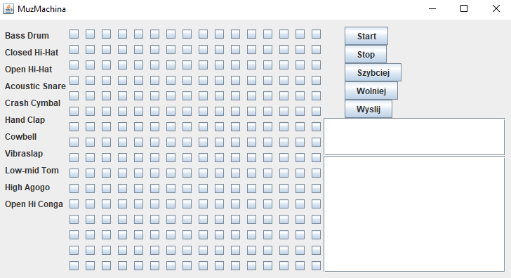

# 🥁 MuzMachina – Sieciowa maszyna perkusyjna z czatem

**MuzMachina** to interaktywny program do tworzenia rytmicznych kompozycji perkusyjnych w czasie rzeczywistym. Umożliwia nie tylko budowanie rytmów, ale również **wysyłanie ich do innych użytkowników** przez sieć oraz prowadzenie rozmów na czacie. Projekt oparty na przykładzie z książki _"Java. Rusz głową!"_, rozszerzony o funkcje komunikacji sieciowej.

## 🎹 Funkcje

- ✅ Interfejs graficzny oparty na Swing (siatka rytmiczna 16x16)
- ✅ 16 instrumentów perkusyjnych (Bass Drum, Hi-Hat, Snare, Tomy itp.)
- ✅ Odtwarzanie rytmu (Start/Stop/Szybciej/Wolniej)
- ✅ Wysyłanie kompozycji przez sieć
- ✅ Wbudowany **czat sieciowy**
- ✅ Możliwość dołączenia do wspólnego serwera podając nazwę użytkownika

## 🖼️ Zrzut ekranu



## 🚀 Jak uruchomić?

### Serwer

Uruchom plik `SerwerMuzMachina.java` na hoście:
```bash
javac SerwerMuzMachina.java
java SerwerMuzMachina

🌐 Wymagania
Java 8 lub nowsza

Połączenie sieciowe (wszystkie klienty muszą łączyć się z tym samym serwerem)

🛠️ Technologie
Java Swing – GUI

Java Socket – komunikacja klient-serwer

Serializable – przesyłanie obiektów (kompozycji)

Multi-threading – obsługa wielu klientów

🗣️ Przykład użycia
Użytkownik A tworzy rytm, klika Wyślij.

Rytm pojawia się u wszystkich innych użytkowników.

Każdy może odtworzyć rytm, zmodyfikować go i odesłać z powrotem.

Użytkownicy mogą czatować w oknie po prawej stronie.

📚 Źródło
Projekt oparty na rozdziale z książki:
"Java. Rusz głową!" – Kathy Sierra & Bert Bates

